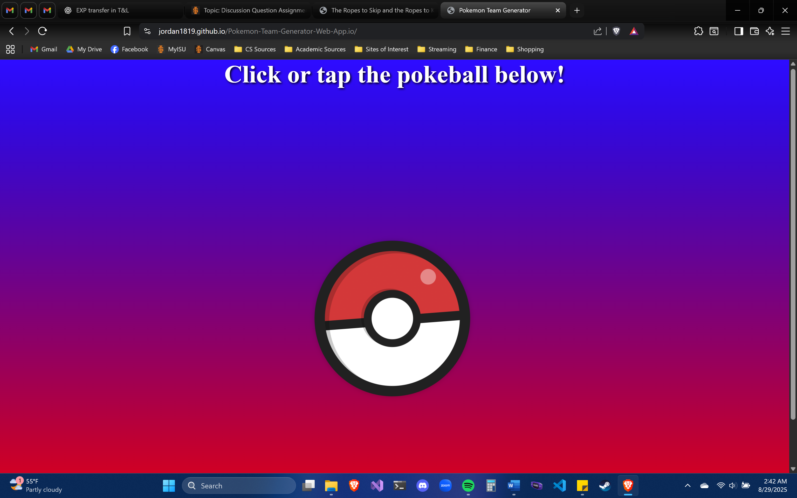
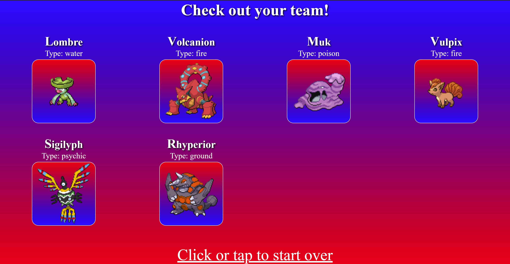
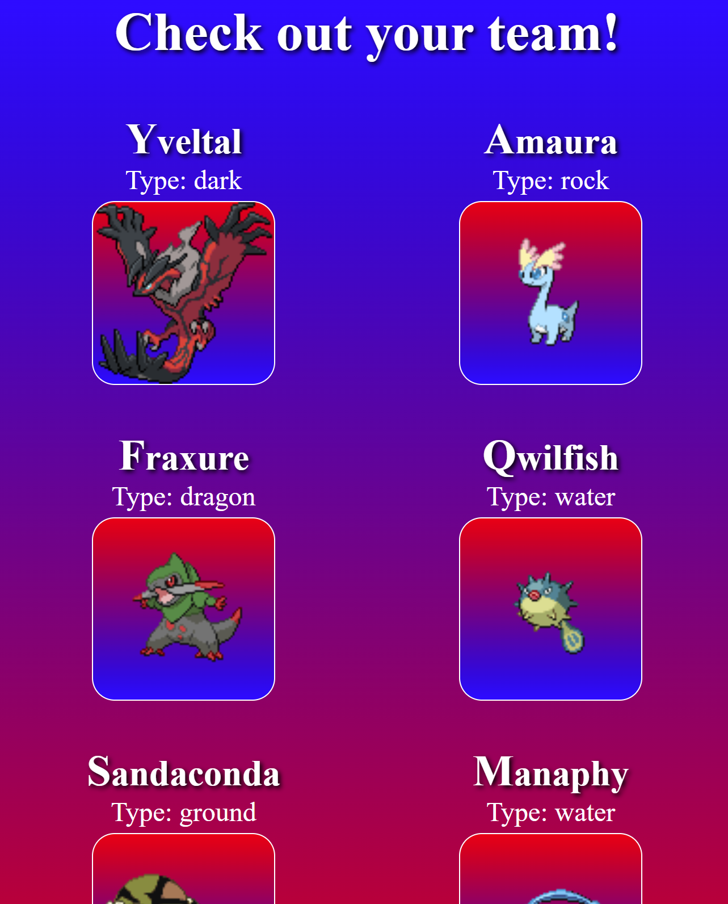

# 🎮 **Pokémon Team Generator Web App** ⚡

Welcome to the **Pokémon Team Generator**! This is a fun, responsive web application that randomly generates a Pokémon team for users. The application was built using **JavaScript**, **HTML**, and **CSS**, and it leverages the **PokeAPI** to fetch Pokémon data and generate teams. This app has been optimized for PC and smartphone use.

Click <a href="https://jordan1819.github.io/Pokemon-Team-Generator-Web-App.io/" target="_blank">here</a> to use the app!

---

## ✨ **Overview** 🌟

This project allows users to generate a **random Pokémon team** by utilizing **JavaScript** to fetch and convert a **.txt file** to **JSON**, then filter and randomize the Pokémon team results. The app dynamically displays a randomly selected team of Pokémon based on various criteria and user inputs.

---

### 🎯 **Purpose**
The goal of this project was to enhance my **JavaScript** skills, particularly in working with **JSON files**, **fetching data**, and **external APIs**. Writing the functions to handle file conversions and data manipulation was an excellent challenge, allowing me to gain hands-on experience with dynamic web content generation.

---

## 🌍 **Web Pages** 🖥️

This project consists of two main webpages:
- **index.html:** Main Pokémon team generator page.
- **results.html:** Results and details page for the randomly generated team.

Both pages share the same style and JavaScript files for consistency. The Pokémon data is fetched from an **external API** and is not part of this repository.

You can find the Pokémon API here: [PokeAPI](https://pokeapi.co)

---

## 📱 Screenshots
---
### PC Browser View

### Smartphone Browser View

## ⚙️ **Development Environment** 💻

This project was developed using **Microsoft VS Code** and utilizes the following technologies:

- **JavaScript**
- **HTML**
- **CSS**

---

## 🌐 **Useful Resources** 📚

Here are some of the resources that helped during development:

- [Stack Overflow](https://stackoverflow.com) - For troubleshooting and finding solutions.
- [W3 Schools](https://w3schools.com) - For learning and reference material on HTML, CSS, and JavaScript.
- [My CodePen](https://codepen.io/Jordan1819) - To test and experiment with small code snippets.

---

## 🚀 **Future Work** 🔮

Some ideas for what could be added in future versions of this app:

- **🎨 Animation:** Add smooth transitions and animations between webpages for a more interactive experience.
- **🔍 Filtering Options:** Allow users to filter Pokémon by various criteria, such as type, name, etc.
- **✨ Shiny Pokémon Toggle:** Enable users to toggle the **shiny** sprite variant for each Pokémon.

---

Thank you for checking out the **Pokémon Team Generator Web App**! 🧑‍💻 Enjoy generating random Pokémon teams and exploring the world of Pokémon with this fun tool. 🌟
